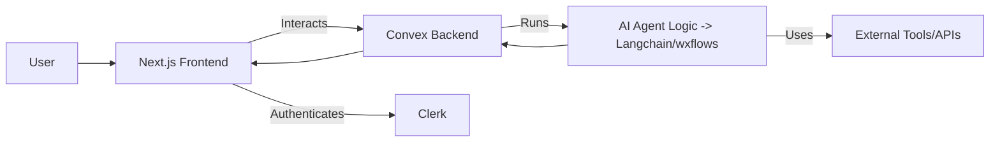

# AI Agent Application

This is a web application built with Next.js, Convex, Langchain, and wxflows, allowing users to interact with an AI agent that can utilize various tools.

## Tech Stack

*   **Frontend:** Next.js 15, React 19, TypeScript, Tailwind CSS, Shadcn/UI (via `components.json`)
*   **Backend:** Convex (Realtime Database & Functions)
*   **Authentication:** Clerk
*   **AI / LLM:** Langchain.js, Langgraph.js, Google Gemini
*   **Agent Tools:** wxflows (defining tools like Web Search, Wikipedia, YouTube Transcript etc.)
*   **Package Manager:** pnpm

## Project Structure Overview



## Getting Started

### Prerequisites

*   Node.js (v20 or later recommended)
*   pnpm (`npm install -g pnpm`)
*   Access keys/credentials for:
    *   Clerk (Publishable Key, Secret Key)
    *   Convex (Deployment URL, Admin Key)
    *   Google AI / Gemini (API Key)
    *   wxflows (if required by the specific SDK/tools)

### Installation

1.  **Clone the repository:**
    ```bash
    git clone <your-repo-url>
    cd ai-agent-app
    ```

2.  **Install dependencies:**
    ```bash
    pnpm install
    ```

3.  **Set up environment variables:**
    Create a `.env.local` file in the root directory and add your credentials. Refer to Clerk, Convex, and Google AI documentation for the specific variable names needed. You'll likely need:

    ```env
    # Clerk
    NEXT_PUBLIC_CLERK_PUBLISHABLE_KEY=pk_***********
    CLERK_SECRET_KEY=sk_***********

    # Convex
    NEXT_PUBLIC_CONVEX_URL=https://************.convex.cloud
    CONVEX_DEPLOYMENT= # Optional: specify a deployment name if needed

    # Google AI
    GOOGLE_API_KEY=AIza***********

    # wxflows (Example - check wxflows SDK docs for actual variables)
    # WXFLOWS_API_KEY=...
    # WXFLOWS_ENDPOINT=...
    ```
    *Note: Add `.env.local` to your `.gitignore` file if it's not already there.*

4.  **Set up Convex backend:**
    Push the schema and functions to your Convex deployment. You might need the Convex CLI.
    ```bash
    # Authenticate with Convex (if needed)
    # npx convex login

    # Deploy functions and schema (requires CONVEX_DEPLOYMENT or interactive selection)
    pnpm convex deploy
    ```
    Alternatively, run the Convex dev server alongside the Next.js app:
    ```bash
    pnpm convex dev
    ```
    This command watches for changes in your `convex/` directory and pushes them automatically. It requires the `CONVEX_ADMIN_KEY` in your environment.

### Running the Development Server

1.  **Start the Next.js development server:**
    ```bash
    pnpm dev
    ```

Open [http://localhost:3000](http://localhost:3000) with your browser to see the result.